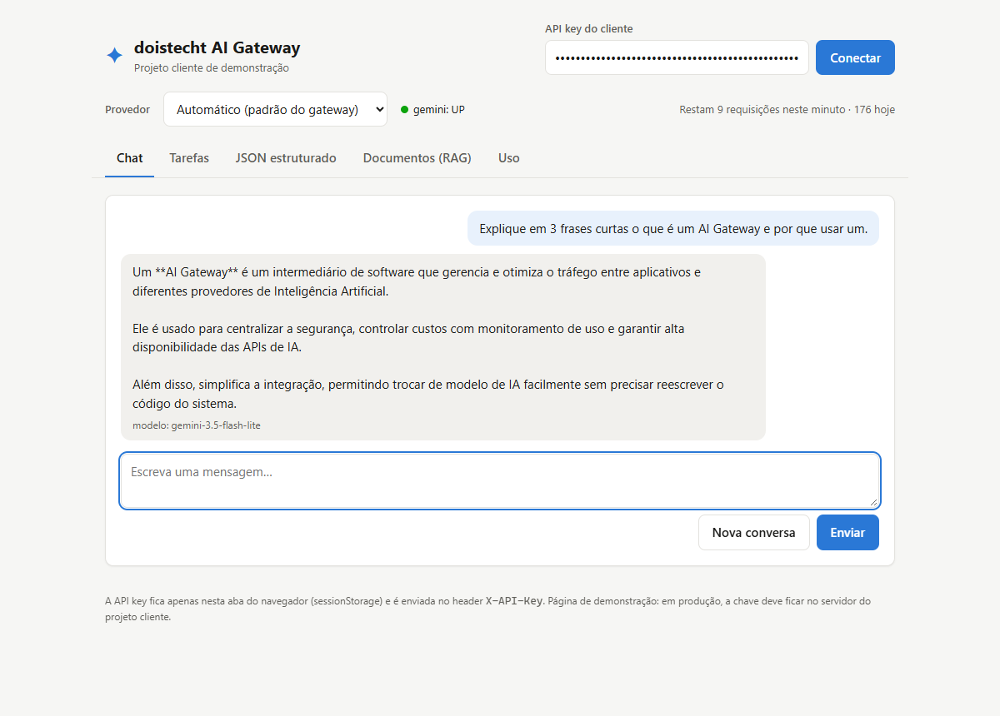
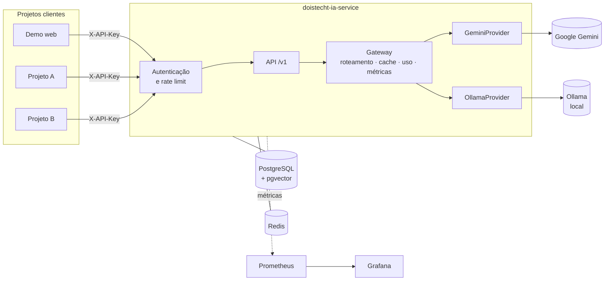
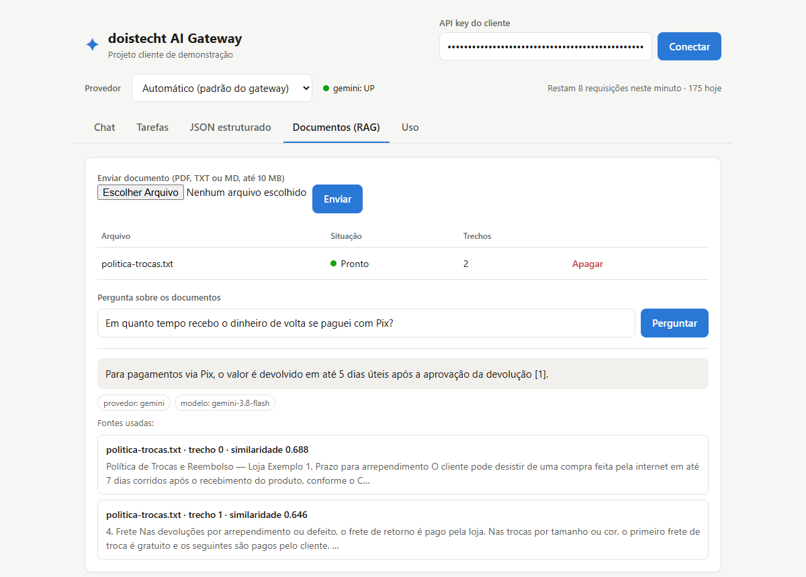
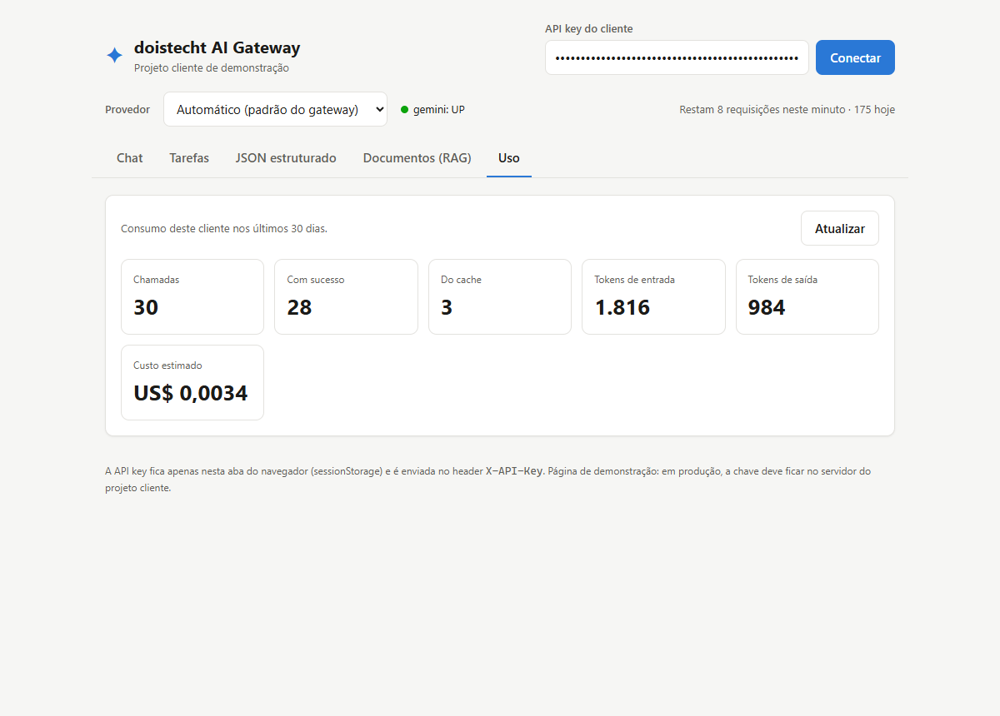
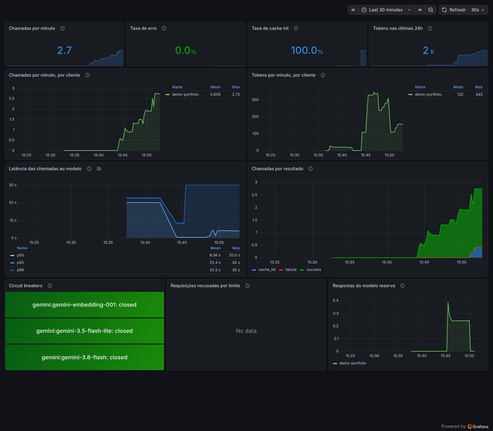

# doistecht-ia-service

[](https://github.com/doistechti/doistecht-ia-service/actions/workflows/ci.yml)

**AI Gateway em Java** que disponibiliza modelos de IA para diversos projetos por meio de uma API única.

Os projetos clientes não chamam o provedor de IA diretamente: falam com este serviço, que cuida de autenticação, limites de uso, cache, templates de prompt, busca em documentos (RAG), resiliência, troca entre provedores e observabilidade.



## O que ele faz

| Área | Funcionalidades |
|---|---|
| **Modelos de IA** | Chat com histórico, streaming (SSE), JSON validado contra JSON Schema, embeddings |
| **Produto** | Tarefas prontas a partir de templates de prompt versionados (globais ou por cliente) |
| **RAG** | Envio de documentos (PDF, TXT, MD), busca semântica com pgvector e respostas com as fontes |
| **Multi-tenant** | API key por projeto cliente (guardada só como hash), rate limit por minuto e cota diária |
| **Custo e uso** | Cache de respostas por cliente, registro de tokens, latência e custo estimado de cada chamada |
| **Resiliência** | Timeout, retry só para erros transitórios, circuit breaker por modelo, modelo reserva e provedor reserva |
| **Provedores** | Gemini (Google AI Studio) e Ollama (modelos locais), com escolha por requisição ou por cliente |
| **Observabilidade** | Métricas no Prometheus e dashboard pronto no Grafana |

## Arquitetura



- **Controllers e serviços** falam só com a interface `AiProvider`. Quem a implementa é o gateway, que escolhe o provedor de cada chamada e aplica cache, registro de uso, métricas e troca de provedor.
- **Cada provedor** implementa `ModelProvider` e tem retry, circuit breaker e modelo reserva próprios. Adicionar um provedor novo é criar mais um bean.
- **O Spring AI fica restrito ao pacote `provider`**. RAG, rate limit, cache e uso são código do projeto.

## Como executar

Pré-requisitos: Docker e uma chave gratuita do Gemini ([Google AI Studio](https://aistudio.google.com/apikey)).

```bash
cp .env.example .env
# edite o .env: GEMINI_API_KEY e IA_SERVICE_ADMIN_KEY (um segredo qualquer, ex.: openssl rand -hex 32)

docker compose up -d --build
```

Depois, cadastre um projeto cliente com a chave de administrador. A resposta traz a API key do cliente, que só é exibida nesse momento:

```bash
curl -X POST http://localhost:8080/v1/admin/clients \
  -H "Content-Type: application/json" \
  -H "X-API-Key: <IA_SERVICE_ADMIN_KEY>" \
  -d '{"name": "meu-projeto"}'
```

Ou use a tela de cadastro em **http://localhost:8088/admin.html**: informe a chave de administrador, preencha o formulário e clique em "Usar na demo" para já entrar com a chave gerada.

Abra a demo em **http://localhost:8088**, cole a API key do cliente e use.

| Serviço | Endereço |
|---|---|
| Demo (projeto cliente) | http://localhost:8088 |
| API e Swagger | http://localhost:8080/swagger-ui.html |
| Grafana (dashboard pronto) | http://localhost:3000 (login no `.env`) |
| Prometheus | http://localhost:9090 |
| Health e métricas (Actuator) | http://localhost:8081/actuator/health (só em localhost) |

**Ollama (opcional):** para usar modelos locais, descomente `COMPOSE_PROFILES=ollama` e `OLLAMA_ENABLED=true` no `.env` e rode `docker compose up -d` de novo. Na primeira vez são baixados cerca de 2,5 GB (llama3.2:3b e nomic-embed-text). Com o Ollama ligado, ele vira o provedor reserva quando o Gemini cai.

O guia completo da API, com exemplos de todas as rotas, está em **[docs/08-guia-da-api.md](docs/08-guia-da-api.md)**. As mesmas chamadas estão prontas em [`requests.http`](requests.http).

## Demo

O projeto cliente de demonstração ([`demo/`](demo)) é uma página em HTML e JavaScript puro servida pelo nginx, que também repassa `/v1` ao gateway (mesma origem, sem CORS). Tem chat com streaming, tarefas, JSON estruturado, documentos com RAG e o consumo do cliente.

| Perguntas sobre documentos (RAG), com as fontes | Consumo do cliente |
|---|---|
|  |  |

## Observabilidade

O Grafana sobe com o dashboard provisionado: chamadas e tokens por cliente, taxa de erro e de cache, latência (p50/p95/p99), estado dos circuit breakers, requisições recusadas por limite e uso do modelo reserva.



## Resiliência

Cada chamada a um provedor passa por:

1. **Timeout** no cliente HTTP. O SDK do Google, por padrão, não tem timeout nenhum.
2. **Retry** com backoff exponencial, só para erros transitórios (408, 429, 5xx, rede). Os retries escondidos do SDK do Google e do Spring AI foram desligados, para existir uma única camada de retry.
3. **Circuit breaker por modelo**: depois de falhas seguidas, o modelo deixa de ser chamado por um tempo e as requisições falham na hora.
4. **Modelo reserva** (`gemini-3.5-flash-lite`) e, se ainda assim falhar, **provedor reserva** (Ollama). A resposta indica `"fallback": true` e não vai para o cache.
5. No **streaming**, a troca só acontece antes do primeiro trecho. Depois disso, o cliente já recebeu parte da resposta.

Com o Redis fora do ar, o serviço continua respondendo, sem cache e sem limites (*fail open*).

Esses mecanismos foram exercitados contra a API real: o `gemini-3.8-flash` respondeu `503` (alta demanda) com frequência nos testes, e o gateway atendeu pelo modelo reserva sem erro para o cliente.

## Qualidade

```bash
./mvnw test      # 116 testes unitários, sem Docker
./mvnw verify    # + 57 testes de integração (PostgreSQL, Redis e WireMock) e cobertura
```

- Testes de integração com **Testcontainers** (PostgreSQL com pgvector e Redis reais) e **WireMock** simulando as APIs do Gemini e do Ollama: os SDKs fazem requisições HTTP de verdade.
- Cobertura de ~93% das linhas, com mínimo de 80% exigido pelo build (JaCoCo).
- **CI no GitHub Actions**: build, testes, relatórios e validação da imagem Docker a cada push.
- Nenhum teste automatizado chama as APIs reais; a validação com o Gemini real foi feita à parte (documentada na [fase 6](docs/07-fase-6-extra.md)).

## Stack

Java 21 (virtual threads) · Spring Boot 4.1 · Spring AI 2.0 · Gemini · Ollama · PostgreSQL 17 + pgvector · Flyway · Redis · Bucket4j · Caffeine · Resilience4j · Apache PDFBox · Micrometer · Prometheus · Grafana · springdoc-openapi · JUnit 5 · Mockito · Testcontainers · WireMock · JaCoCo · Docker · GitHub Actions

## Decisões técnicas

As principais decisões, com o contexto e as alternativas consideradas, estão registradas como ADRs em [`docs/adr/`](docs/adr):

- [Spring AI isolado atrás de interfaces próprias](docs/adr/0001-spring-ai-isolado.md)
- [Cache, uso e métricas em um decorator (gateway)](docs/adr/0002-gateway-como-decorator.md)
- [Rate limit com Bucket4j + Redis e fail open](docs/adr/0003-rate-limit-bucket4j-redis.md)
- [Uma única camada de retry](docs/adr/0004-uma-camada-de-retry.md)
- [RAG próprio com pgvector em SQL](docs/adr/0005-rag-com-pgvector-em-sql.md)
- [Embeddings pelo SDK do Google](docs/adr/0006-embeddings-pelo-sdk-do-google.md)
- [Roteamento e fallback entre provedores](docs/adr/0007-roteamento-entre-provedores.md)

## Estrutura

```
src/main/java/br/com/doistecht/iaservice
├── api          # controllers e DTOs (/v1)
├── gateway      # roteamento de provedores, cache, registro de uso
├── provider     # contratos, resiliência e provedores (gemini/, ollama/)
├── client       # clientes (tenants) e API keys
├── ratelimit    # rate limit e cota diária
├── template     # templates de prompt versionados
├── task         # tarefas prontas
├── structured   # output estruturado e validação de JSON Schema
├── document     # ingestão de documentos e busca vetorial
├── rag          # perguntas sobre documentos
├── usage        # registro de uso e custo
├── metrics      # métricas do gateway
└── security     # autenticação por API key
demo/            # projeto cliente de demonstração (HTML + JS + nginx)
monitoring/      # Prometheus e Grafana (datasource e dashboard provisionados)
docs/            # escopo, fases, guia da API e ADRs
```

## Documentação

- [Escopo do projeto](docs/01-escopo-do-projeto.md) e o detalhamento de cada fase, de [1](docs/02-fase-1-mvp.md) a [6](docs/07-fase-6-extra.md)
- [Guia da API](docs/08-guia-da-api.md)
- [Decisões técnicas (ADRs)](docs/adr)

> **Aviso:** no plano gratuito do Gemini, os dados enviados podem ser usados pelo Google para melhorar os modelos. Não envie dados sensíveis.
